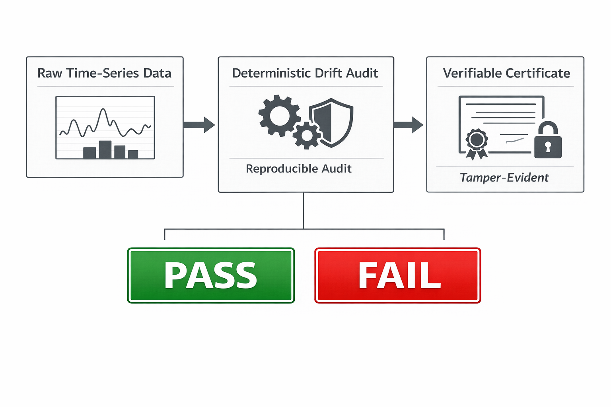

**Certificate-Based Drift Detection Audit for Time-Series Forecasting (Electricity Demand × Weather)**

**Keywords**: drift detection, time-series forecasting, model monitoring, MLOps, audit trail, reproducibility, accountability, electricity demand forecasting



**Protocol overview: Raw data → deterministic audit → certificate → PASS/FAIL.**

Here, “drift” means an operational integrity breach (data/logic/config mismatch) that makes the verdict non-reproducible—not a statistical change optimized by post-hoc tuning.
ai-drift-detector (Ghost Drift Audit v9.9) is a deterministic audit protocol for time-series operations. It binds inputs and logic to tamper-evident fingerprints, then outputs a reproducible certificate and an append-only ledger so any third party can re-run the same audit and obtain the same PASS/FAIL verdict.

Note: Bundled CSVs are reproducibility datasets provided to verify the audit protocol. The system is designed with strict data binding; it will cease execution if the input integrity or logic identity does not match the predefined fingerprints.

---

🔗 Quick Links

* 📂 **Source Code:** [GitHub Repository](https://github.com/GhostDriftTheory/ai-drift-detector)
* 📜 **Main Script:** [ghost_drift_audit_EN.py](https://github.com/GhostDriftTheory/ai-drift-detector/blob/main/ai-drift-detector.py)
* 📦 **Download:** [Project ZIP](https://github.com/GhostDriftTheory/ai-drift-detector/archive/refs/heads/main.zip)
* 📖 **Documentation:** [Online Manual](https://ghostdrifttheory.github.io/ai-drift-detector/) ([⚙️ Jump to Execution Mode](https://ghostdrifttheory.github.io/ai-drift-detector/#profile))
* 🚨 **Support:** [Report Issues](https://github.com/GhostDriftTheory/ai-drift-detector/issues)

---

## 📑 Audit Report (PDF)

- **Report:** [Scientific Audit Report on Structural Integrity of Forecasting Models](./Scientific%20Audit%20Report%20on%20Structural%20Integrity%20of%20Forecasting%20Models.pdf)
- **Verdict:** NG (TAU_CAP_HIT)
- **Protocol:** Ghost Drift Audit v8.0

---

## 💎 Design Philosophy: From "Probabilistic" to "Accountable"

To address the “opaque inference” problem in conventional AI operations, this framework provides:

> [!TIP]
> **Audit-First Design**  
> Alongside running predictions, it automatically generates objectively verifiable **evidence** for third parties.

> [!IMPORTANT]
> **Tamper-Evident Fingerprints**  
> It fixes hash fingerprints of input data and configuration parameters, making post-hoc modifications mathematically detectable.

> [!NOTE]
> **Verifiable Integrity**  
> Rather than mere statistical optimality, it makes visible the model’s **faithful adherence** to operational rules.

---

## 🛠 Technical Specifications

### System Requirements

- **Language:** Python 3.10+
- **Dependencies:** numpy, pandas, matplotlib, lightgbm

### Project Structure

```text
.
├── ghost_drift_audit_JP.py    # Core Logic & Audit Engine
├── electric_load_weather.csv  # Input: Weather (dummy for smoke test)
├── power_usage.csv            # Input: Demand (dummy for smoke test)
└── adic_out/                  # Output: Accountability Ledger

```

---

## ⚙️ Execution Profiles

Strictness is selected in `ai-drift-detector.py`.

- demo (Low): learn the protocol and output format
- paper (Mid): reproducible experiments (fixed seeds)
- commercial (High): production gates (Logic/Source identity checks)

### Configuration (ai-drift-detector.py)

STRICT_AUDIT_MODE = True  # v9.9: Logic Identity + BOM resilience enabled


## 🚀 Deployment & Usage

### 1) Setup

pip install numpy pandas matplotlib

### 2) Data

Place `power_usage.csv` and `electric_load_weather.csv` next to the `.py` script.

[!CAUTION]
Strict Mode has no synthetic fallback. Use the provided reproducibility datasets or your own audited datasets (valid headers required).

### 3) Run

python ai-drift-detector.py

### 4) Outputs

- `audit_record.json` : certificate (execution conditions + logic fingerprints)
- `audit_log.jsonl`   : append-only hash-chain ledger
- `audit_bundle.zip`  : self-contained verification bundle


## 🎯 Scope & Limits

- Scope: makes structural shifts observable and verifiable (via the audit protocol)
- Non-claims: does not guarantee future correctness; guarantees audit reproducibility


## 🛡️ Threat Model

- Threshold manipulation: certificate mismatch / Cap record mismatch
- Logic manipulation: Logic Identity Proxy hash change
- Data fabrication: Source Identity (SHA-256) mismatch


## 📜 License & Notice

- Code: MIT License
- Reproducibility data: included for protocol verification
- Patent notice: pending JP application (特願2025-182213). MIT usage is unchanged.


From “prediction” to “accountability.”
GhostDrift Mathematical Institute (GMI)
